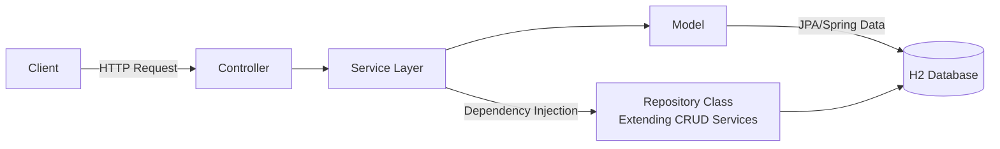
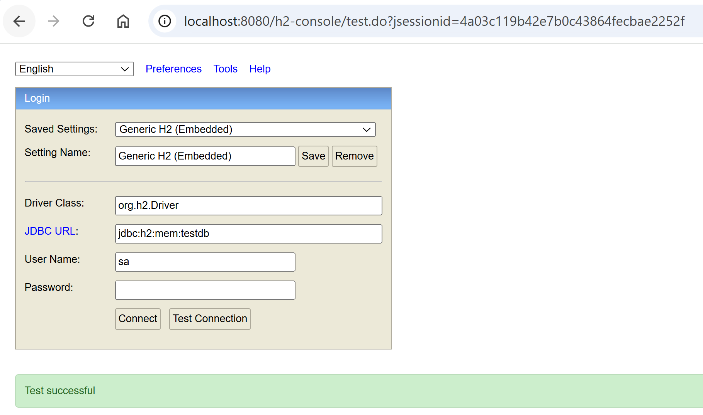

# 🚀 **FinCraft - Learning Project**

[](https://github.com/anoopsimon/fincraft/blob/main/.github/workflows/build-test.yml)
[](https://opensource.org/licenses/MIT)
[](https://www.oracle.com/java/technologies/javase/jdk17-archive-downloads.html)

## **1. About the Project**
This is a simple backend project designed to help understand the basics of building REST APIs and working with databases in **Spring Boot**. The application provides endpoints to manage user data, such as creating and fetching user records.  

**Note**: This is not a production-grade project; it is purely for **learning purposes**.

---



## 🛠️ **Tech Stack**
- **Backend**: Java 17 with Spring Boot 3.4.0
- **Database**: H2 (in-memory database)
- **Build Tool**: Gradle
- **Testing**: Spring Boot Starter Test (JUnit 5)

---

## 📦 **Dependencies Used**
Here are the key dependencies used in this project:

- **Spring Boot Starter Web**: For building REST APIs.
- **Spring Boot Starter Data JPA**: For interacting with the database.
- **H2 Database**: In-memory database for development and testing.
- **Spring Boot Starter Test**: For unit and integration testing.
- **Lombok**: To reduce boilerplate code (e.g., getters, setters, constructors).

**`build.gradle` snippet**:
```groovy
dependencies {
    implementation 'org.springframework.boot:spring-boot-starter-data-jpa'
    implementation 'org.springframework.boot:spring-boot-starter-web'
    runtimeOnly 'com.h2database:h2'
    compileOnly 'org.projectlombok:lombok'
    annotationProcessor 'org.projectlombok:lombok'
    testImplementation 'org.springframework.boot:spring-boot-starter-test'
}
```

---

## 🖥️ **Backend Details**
The backend is built using **Spring Boot** and includes the following functionalities:
- **REST API Endpoints**:
  - `GET /api/users`: Fetch all users.
  - `GET /api/users/{id}`: Fetch a user by ID.
  - `POST /api/users`: Create a new user.

- **Data Model**:
  A `User` entity with the following fields:
  - `id` (Auto-generated)
  - `name`
  - `email`

---

## 🗄️ **How to Connect to H2 Database**

### H2 Console:
You can access the H2 database console using the following steps:
1. Start the application.
2. Open your browser and navigate to:
   ```
   http://localhost:8080/h2-console
   ```

3. Use the following credentials:
   - **JDBC URL**: `jdbc:h2:mem:testdb`
   - **Username**: `sa`
   - **Password**: (leave blank)



### Sample Query to Verify Data:
Once connected, you can execute SQL queries to view the `user` table:
```sql
SELECT * FROM "user";
```

---

## 🚀 **How to Run the Project**
1. Clone the repository.
2. Open the project in IntelliJ IDEA or any other IDE.
3. Build and run the project:
   ```bash
   ./gradlew bootRun
   ```
4. Test the endpoints using tools like **Postman**, **IntelliJ HTTP Client**, or a browser.
   [HttpClient - IntelliJ](https://www.jetbrains.com/help/idea/exploring-http-syntax.html#environment-variables)
---

## 🐳 **Run This App Using Docker Compose**

You can run the entire application with a single command using **Docker Compose**. Ensure you have **Docker** installed on your system.

### **Steps to Run**
1. Navigate to the root directory of the project where `docker-compose.yml` is located.
2. Run the following command to start all services:
   ```bash
   docker-compose up --build
   ```
3. Access the following services:
    - **Spring Boot App**: [http://localhost:8080](http://localhost:8080)
    - **H2 Console**: [http://localhost:8081](http://localhost:8081)
        - **JDBC URL**: `jdbc:h2:mem:testdb`
        - **Username**: `sa`
        - **Password**: *(leave blank)*

---

## 🛠️ **Use Make Commands**

For simplified management of the application, you can use the provided **Makefile**. This requires **Make** to be installed on your system.

### **Common Commands**
- **Build the Application**:
  ```bash
  make build
  ```
- **Start the Application**:
  ```bash
  make up
  ```
- **Stop the Application**:
  ```bash
  make down
  ```
- **View Logs**:
  ```bash
  make logs
  ```
- **Clean Up Resources**:
  ```bash
  make clean
  ```

### **Why Use Make?**
- **Simplifies Workflow**: No need to remember complex `docker-compose` commands.
- **Consistency**: Ensures uniformity across different environments.
- **Ease of Use**: Quickly manage services with shorter, predefined commands.

---


## 📊 **Sample Data**
The project loads initial user data from an SQL file (`config/data.sql`) at startup. Example records:
- `John Doe (john.doe@example.com)`
- `Jane Doe (jane.doe@example.com)`
- Additional realistic users included.

---

## 📑 **API Documentation - Swagger UI**

This project includes **Swagger UI** for interactive API documentation and testing.

### **How to Access Swagger Documentation**

1. Start the application.
2. Open your browser and go to the following URL:
   ```
   http://localhost:8080/swagger-ui.html
   ```

### **Available Endpoints**

Swagger UI will display and allow testing of all available endpoints, such as:
- **`GET /api/users`**: Fetch all users.
- **`GET /api/users/{id}`**: Fetch a user by ID.
- **`POST /api/users`**: Create a new user.

### **OpenAPI Specification**
If you need the raw OpenAPI JSON specification, access it at:
```
http://localhost:8080/v3/api-docs
```

---
## 🤝 **Contributing**
This is a learning project, so feel free to explore, modify, and experiment.

---

### 📧 **Contact**
For queries or suggestions, feel free to contact:  
**Name**: Anoop Simon  
**Email**: s451421990@gmail.com

---
